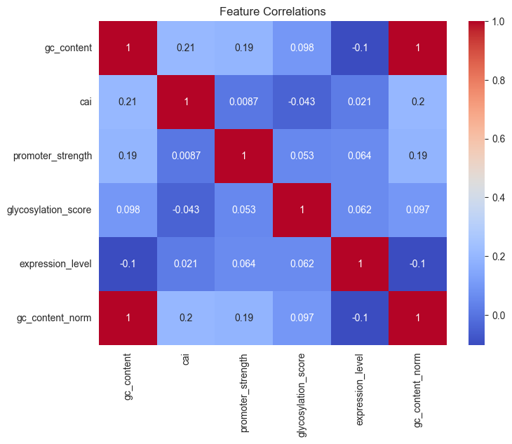

Objective: Design and optimize a genetic construct for expressing the Aβ1-42 antigen in
*Physcomitrella patens* (moss) for molecular pharming applications in Alzheimer’s vaccine research.

**Note:** This is my first-ever medical Python project. I used AI (“vibe coding”) to help write the code, but I also double-checked important data like the Aβ1-42 DNA and protein sequences myself to make sure they were real and the results stayed closer to reality.

Please note that this is **not an application-ready project**, since some of the data are not real. For example, the five
features in Step 2.2 contain 100 random numbers each instead of real data, which would normally need to be prepared from
thousands of genes. The `cai_estimate` value in Step 3.2 is also a simulated value.

I have noted in the Markdown sections wherever the data are simulated or where more explanation is needed.

